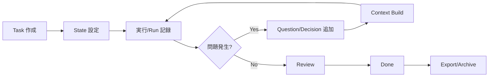

# agent-taskstate Blueprint

## 1. Problem Statement

**誰の課題**: 長期タスクを扱う LLM エージェントまたは人間

**何の課題**: チャット履歴や KV キャッシュに依存せず、タスクの進行状態を構造化して保持する手段がない。会話が長くなると文脈が失われ、再開時に最初から読み直す必要がある。

**なぜ今解くか**: エージェントによる自律的な長期タスク実行が増加しているが、状態管理のベストプラクティスが確立されていない。会話履歴への依存を断ち切り、明示的な状態管理を行うことで、より信頼性の高い長期タスク実行を実現する。

## 2. Scope

### In (MVP)

- Task の作成・更新・状態遷移
- Task State の取得・更新（optimistic lock 付き）
- Decision の追加・承認・拒否
- Open Question の追加・回答・延期
- Run の開始・終了記録
- Context Bundle の生成・参照
- Task 単位の JSON export
- SQLite ベースのローカル CLI

### Out (MVP 非対象)

- 自律実行ランタイム
- 複数エージェント協調制御
- Jira / GitHub Issues との完全同期
- 高度な検索 / 埋め込み検索
- GUI / Web UI
- 認可・権限管理
- 分散構成
- API / MCP サーバー（設計は考慮、実装は後続フェーズ）

## 3. Constraints / Assumptions

### 制約

- **単一ユーザー前提**: 同時アクセス制御は optimistic lock のみ
- **ローカル実行**: ネットワーク接続不要、オフライン動作可能
- **SQLite 単体**: 追加の DB サーバー不要
- **Python 3.9+**: 実行環境

### 前提

- **Agent-First**: 機械が叩きやすい安定した入出力を優先
- **Chat-History-Free**: チャット履歴を正本にしない
- **Append-Oriented**: 変更は上書きではなく追加と状態更新を優先
- **Loose Coupling**: memx や tracker とは typed_ref による疎結合連携

### 互換性

- CLI 出力形式は将来の API / MCP へそのまま写像可能
- typed_ref 形式で外部システム参照を許容
- JSON export 形式は将来 import 可能な構造

## 4. I/O Contract

### Input (CLI Arguments)

```bash
# Task 作成
agent-taskstate task create --kind <bugfix|feature|research> --title <string> --goal <string> \
  --priority <low|medium|high|critical> --owner-type <human|agent|system> --owner-id <string>

# State 更新
agent-taskstate state patch --task <id> --expected-revision <n> --file <json>

# Context Bundle 生成
agent-taskstate context build --task <id> --reason <normal|ambiguity|review|high_risk|recovery>
```

### Output (JSON)

```json
// 成功時
{
  "ok": true,
  "data": { "task_id": "01H..." },
  "error": null
}

// エラー時
{
  "ok": false,
  "data": null,
  "error": {
    "code": "validation_error",
    "message": "kind is required"
  }
}
```

### Error Codes

| Code | Description |
|------|-------------|
| `not_found` | 指定された ID のエンティティが存在しない |
| `validation_error` | 必須フィールド欠落、型不正、列挙値不正 |
| `invalid_transition` | 状態遷移ガード違反 |
| `conflict` | revision 不一致（optimistic lock） |
| `dependency_blocked` | 外部依存の解決不可（将来用） |

## 5. Minimal Flow



## 6. Interfaces

### CLI Commands

| Command | Description |
|---------|-------------|
| `agent-taskstate task create/show/list/update/set-status` | Task 管理 |
| `agent-taskstate state get/put/patch` | Task State 管理 |
| `agent-taskstate decision add/list/accept/reject` | Decision 管理 |
| `agent-taskstate question add/list/answer/defer` | Open Question 管理 |
| `agent-taskstate run start/finish` | Run 記録 |
| `agent-taskstate context build/show` | Context Bundle 管理 |
| `agent-taskstate export task` | JSON Export |

### API Mapping (将来)

| CLI | API |
|-----|-----|
| `task create` | `POST /tasks` |
| `task show` | `GET /tasks/{id}` |
| `state patch` | `PATCH /tasks/{id}/state` |
| `context build` | `POST /tasks/{id}/context-bundles` |

### MCP Tools (将来)

- `agent_taskstate_task_create`
- `agent_taskstate_state_patch`
- `agent_taskstate_decision_add`
- `agent_taskstate_context_build`

## 7. Key Metrics

| Metric | Target | Description |
|--------|--------|-------------|
| Operation Latency | < 1s | 主要操作の体感速度 |
| Context Recovery | < 5s | Context Bundle からの状態再構成 |
| Test Coverage | > 90% | 正常系・異常系のカバレッジ |

## 8. Dependencies

### 内部依存

- `docs/src/agent-taskstate_mvp_spec.md` - MVP 仕様書
- `docs/src/agent-taskstate_sqlite_spec.md` - SQLite スキーマ
- `docs/tests/*.feature` - テストシナリオ

### 外部依存（将来）

- `memx` - 記憶・証拠・知識の外部基盤（typed_ref で参照）
- `tracker-bridge` - Jira / BTS 同期層（typed_ref で参照）